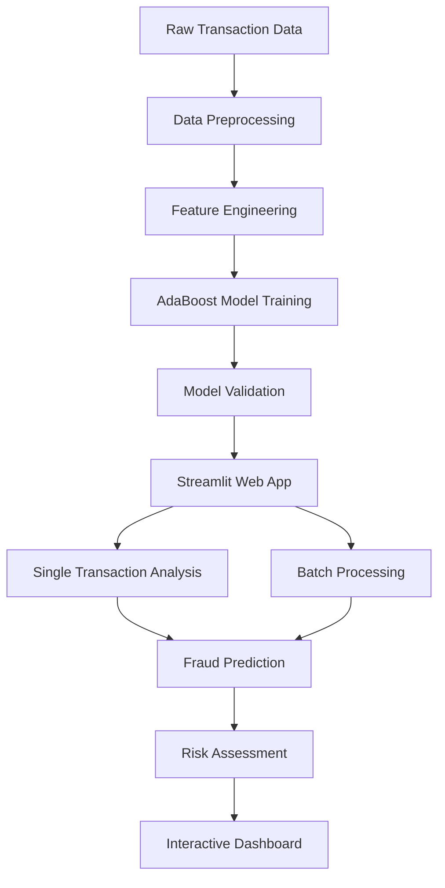

# 🚨 Fraud Transaction Detection System

<div align="center">


**An AI-powered fraud detection system with real-time analysis and interactive dashboard**

[🚀 Demo](#demo) • [📖 Documentation](#documentation) • [⚡ Quick Start](#quick-start) • [🤝 Contributing](#contributing)

</div>

---

## 📋 Table of Contents

- [🎯 Overview](#-overview)
- [✨ Key Features](#-key-features)
- [🏗️ Architecture](#️-architecture)
- [🎲 Fraud Simulation Logic](#-fraud-simulation-logic)
- [🤖 Model Performance](#-model-performance)
- [🚀 Quick Start](#-quick-start)
- [💻 Usage](#-usage)
- [📊 Dataset](#-dataset)
- [🛠️ Technologies](#️-technologies)
- [📁 Project Structure](#-project-structure)

- [📜 License](#-license)

## 🎯 Overview

The **Fraud Transaction Detection System** is a cutting-edge AI-powered solution designed to identify fraudulent financial transactions in real-time. Built with advanced machine learning algorithms and featuring an intuitive web interface, this system provides both individual transaction analysis and batch processing capabilities with exceptional accuracy.

### 🎯 Project Objectives

- 🔍 **Real-time Detection**: Analyze transactions instantly with high precision
- 📊 **Batch Processing**: Handle large datasets efficiently
- 🎨 **Interactive Dashboard**: Provide intuitive visualizations and insights
- ⚡ **High Performance**: Achieve >99% accuracy with minimal false positives
- 🔄 **Scalable Architecture**: Support enterprise-level transaction volumes

## ✨ Key Features

| Feature | Description |
|---------|-------------|
| 🤖 **AI-Powered Detection** | Advanced AdaBoost ensemble learning algorithm |
| 🎯 **99.97% Accuracy** | Exceptional precision with minimal false negatives |
| 🖥️ **Interactive Dashboard** | Modern dark-themed UI with real-time visualizations |
| ⚡ **Real-time Analysis** | Instant fraud detection for individual transactions |
| 📦 **Batch Processing** | Efficient handling of large transaction datasets |
| 📊 **Risk Assessment** | Three-tier risk classification (LOW/MEDIUM/HIGH) |
| 📈 **Visual Analytics** | Interactive charts and graphs using Plotly |
| 💾 **Export Functionality** | Download processed results as CSV |
| 🔒 **Secure Processing** | Safe handling of sensitive financial data |

## 🏗️ Architecture



## 🎲 Fraud Simulation Logic

Our sophisticated fraud simulation engine implements three distinct fraud patterns:

### 1. 💰 High-Amount Fraud
- **Logic**: Transactions > $220 are flagged as fraudulent
- **Purpose**: Detect unusually large transactions
- **Application**: Basic validation and threshold-based detection

### 2. 🖥️ Terminal Fraud
- **Logic**: 2 random terminals selected daily → all transactions fraudulent for 28 days
- **Purpose**: Simulate compromised payment terminals
- **Pattern**: Represents real-world terminal skimming attacks

### 3. 👤 Customer Fraud
- **Logic**: 3 random customers selected daily → 1/3 of transactions (×5 amount) fraudulent for 14 days
- **Purpose**: Simulate stolen credentials and card-not-present fraud
- **Pattern**: Models account takeover scenarios

## 🤖 Model Performance

<div align="center">

### 🏆 Exceptional Results Achieved

| Metric | Score | Description |
|--------|-------|-------------|
| **🎯 Accuracy** | **99.97%** | Overall prediction correctness |
| **🔍 F1 Score** | **99.97%** | Balanced precision and recall |
| **📊 Recall** | **97.55%** | True fraud detection rate |
| **📈 ROC AUC** | **98.77%** | Model discrimination ability |

</div>

> **💡 Why AdaBoost?** 
> - Excellent performance on imbalanced datasets
> - Robust ensemble learning approach
> - Minimal overfitting with proper regularization
> - Fast prediction times suitable for real-time applications

## 🚀 Quick Start

### Prerequisites

- Python 3.8+
- pip package manager
- 4GB+ RAM recommended

### 🔧 Installation

1. **Clone the repository**
   ```bash
   git clone https://github.com/yourusername/fraud-transaction-detection.git
   cd fraud-transaction-detection
   ```

2. **Create virtual environment**
   ```bash
   python -m venv fraud_detection_env
   source fraud_detection_env/bin/activate  # On Windows: fraud_detection_env\Scripts\activate
   ```

3. **Install dependencies**
   ```bash
   pip install -r requirements.txt
   ```

4. **Run the application**
   ```bash
   streamlit run app.py
   ```

5. **Access the dashboard**
   ```
   🌐 Local URL: http://localhost:8501
   🌍 Network URL: http://your-ip:8501
   ```

## 💻 Usage

### 🔍 Single Transaction Analysis

1. Navigate to the **Single Transaction** tab
2. Enter transaction details:
   - Customer ID
   - Terminal ID
   - Transaction Amount
   - Date and Time
3. Click **🔍 Analyze Transaction**
4. View results:
   - Fraud/Safe classification
   - Confidence score
   - Risk level assessment
   - Visual risk factor breakdown

### 📦 Batch Processing

1. Switch to the **Batch Processing** tab
2. Upload your CSV file with transaction data
3. Required columns:
   ```
   CUSTOMER_ID, TERMINAL_ID, TX_AMOUNT, DAY, MONTH, YEAR, HOUR, MINUTE
   ```
4. Click **🚀 Process Transactions**
5. Review results:
   - Summary statistics
   - Interactive visualizations
   - Download processed results

## 📊 Dataset

### 📈 Dataset Overview

- **Source**: Synthetic financial transaction data
- **File**: `processed_fraud_data.csv`
- **Size**: [Number of transactions] records
- **Features**: 8 key transaction attributes
- **Labels**: Binary classification (0: Safe, 1: Fraud)

### 📋 Feature Description

| Feature | Type | Description |
|---------|------|-------------|
| `CUSTOMER_ID` | Integer | Unique customer identifier |
| `TERMINAL_ID` | Integer | Payment terminal identifier |
| `TX_AMOUNT` | Float | Transaction amount in USD |
| `DAY` | Integer | Day of transaction (1-31) |
| `MONTH` | Integer | Month of transaction (1-12) |
| `YEAR` | Integer | Year of transaction |
| `HOUR` | Integer | Hour of transaction (0-23) |
| `MINUTE` | Integer | Minute of transaction (0-59) |

## 🛠️ Technologies

<div align="center">

| Category | Technologies |
|----------|-------------|
| **🧠 Machine Learning** |    |
| **🌐 Web Framework** |  |
| **📊 Visualization** |  |
| **💾 Data Processing** |   |

</div>

## 📁 Project Structure

```
fraud-transaction-detection/
│
├── 📊 data/
│   └── processed_fraud_data.csv      # Processed dataset
│
├── 🤖 models/
│   └── ada_model.pkl                 # Trained AdaBoost model
│
├── 📱 app/
│   └── app.py                        # Streamlit web application
│
├── 📚 notebooks/
│   └── NoteBook.txt                  # Development notes and logic
│
├── 📋 requirements.txt               # Python dependencies
├── 🔧 config.py                     # Configuration settings
├── 📖 README.md                     # Project documentation
└── 📜 LICENSE                       # MIT License
```

## 📜 License

This project is licensed under the MIT License - see the [LICENSE](LICENSE) file for details.


<div align="center">
Made with ❤️ for secure financial transactions
</div>
